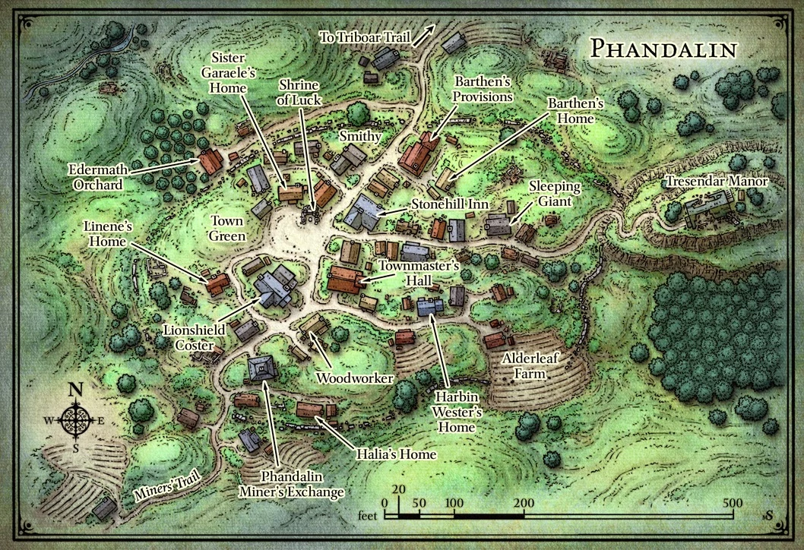

# Phandalin

## Sword Coast

## Hook

- Abenteurer aus Neverwinter

- haben gehört das es arbeit in Phandalin gibt
  
  - viele mienenarbeiter und handwerker
  
  - wildes orc volk in der nähe das ärger bereitet
  
  - angeblich auch ein drache

## Phandalin

#### Backstory

- Auf Ruinen von 100 jahre alter stadt aufgebaut
  
  - von menschen bewohnt die mit den Zwergen und Gnomen im Umfeld verbündet waren

- Neu aufbau hat vor 3-4 Jahren begonnen 
  
  - Siedler aus Neverwinter und Waterdeep sind hergezogen
  
  - Jetzt Heimat von Bauern, Holzfällern, Händlern und Prospektoren
  
  - Alle angezogen von dem Versprechen von Gold und Platin

- Der Drache bedroht alles was die Siedler aufgebaut haben

#### Ankunft

> In einem Taal zwischen felsigen Vorbergen des schneebedeckten *Sword Mountain* befindet sich die Bergbausiedlung Phandalin, welche eine Sammlung von 30 bis 40 einfachen Holzhütten ist. Bröckelnde Ruininen zwischen und rund um die neuen Häuser und Läden sind Zeugen davon, das dieser Ort einst eine weit größere Stadt gewesen sein muss.
> 
> Die Einwohner von Phandelin sind zurückhaltende, hart arbeitende Leute die von weit entfernten Orten hergezogen sind, um in der harschen Wildniss ihren Lebensunterhalt zu bestreiten. Sie sind Bauern, Holzfäller, Händler, Prospektoren und Kinder. Das Städchen hat keine mauern und keine Garrisonen, aber die meisten Erwachsenen haben eine Waffe in Greifbarer Nähe.
> 
> Besucher sind gerne gesehen, vor allem wenn sie Gold ausgeben oder Neuigkeiten mitbringen. Das *Stonehill Inn* im Zentrum der Stadt bietet eine bescheidene Bleibe und Malzeiten. Ein paar Türen weiter findet sich das Rathaus und davor eine Tafel an die Abenteuer und offene Stellen angeschlagen sind

#### Points of Interest

Nach unterhaltung die gut gelaufen ist Phandelin Tabelle Würfeln

###### Stonehill Inn

- Bescheidene, zweistöckige Taverne mit 6 Zimmern im oberen Geschoss
  
  - Übernachten: 5 sp
  
  - Malzeit: 1SP

- NPC
  
  - **Toblen Stonehill** (Besitzer)
    
    - Einer der ersten Siedler
    
    - Klein, Freundlich, 34
    
    - Ist hergekommen um zu schürfen -> festgestellt das er besser im Betrieb ist

###### Barthen's Provision

- Laden, verkauft die meisten Sachen, Waffen & Rüstung und Heiltränke ausgenommen, bis 25 gp
  
  - Wenn Waffen verweis nach *Lionshield Coster*
  
  - Wenn Heiltränke verweis nach *Umbrage Hill*

- NPC
  
  - **Elmar Barthen** (Besitzer)
    
    - Schlank, halbglatze, mitte 50
  
  - **Ander & Thistle** (Angestellte) 

###### Lionshield Coster

> Über der Tür hängt ein Schild einem tatsächlichem Schild nachgeamt auf das ein blauer Löwe gemalt ist

- Gebäude ist Eigentum des Unternehmens *Lionshield* 
- Verkauft Waffen & Rüstung
- NPC
  - **Linene Graywind** (Meister)
    - scharfzüngig, 35
    - verkauft nichts an leute die gefahr darstellen könnten

###### Phandalin Miner's Exchange

- Gebäude der Prospektor Gilde

- Bergarbeiter verkaufen hier ihre Erze

- Gesselliger Ort

- NPC
  
  - **Halia Thornton** (Gilden meisterin)
    
    - mitte 40
    
    - mitglied von Zhentarim, zwielichtige Organisation die Kontrolle über den Norden ergreifen möchte. Viel Einfluss und Geld

###### Schrine of Luck

- Tempel aus Steinen der Ruinine gebaut

- Tymora (Göttin des Glücks) gewitmet

- Acolyt zurzeit in Neverwinter

- NPC
  
  - Schwester Garaele
    
    - Elfin, 200
    
    - Mitglied der Abenteurer Gruppe: *Harpers*
    
    - Berichtet regelmäßig ihren vorgesetzten

###### Townmaster's Hall

> Das Rathaus hat solide Steinwände, ein mit hölzernen Schindeln belegtes Dach und einen kleinen Glockenturm an der Rückseite. Vor dem Gebäude steht einen Tafel mit diversen Job angeboten die in *common* geschrieben sind

- NPC
  
  - **Harbin Wester** (Bürgermeister & Quest giver)
    
    - pompös, mittlern alters, bänker
    
    - seit ankunft des Drachens sehr zurückgezogen und ängstlich
    
    - Öffnet die tür nicht und spricht nur hindurch
